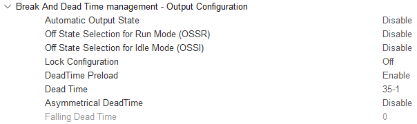
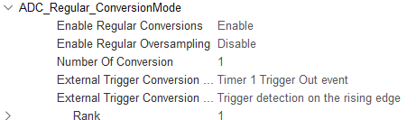
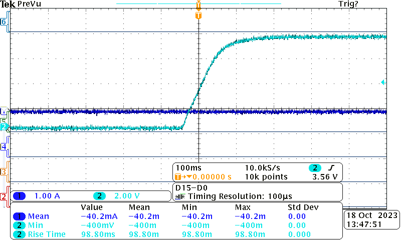

# 2324_ESE3745_LESNE_LIENART

## Introduction
Le but de la série de TP est d'asservir une MCC en commandant un pont en H grâce à des PWM générées par une STM32.


## TP1 :
### Console UART
Dans un soucis de gain de temps pour l'implantation d'une fonctionnalité sans rapport avec la commande de moteurs, nous avons récupéré le shell écrit par Mr. Papazoglou. 

### Génération de PWM
* Pour la génération des PWM nous utilisons le **Timer 1** pour générer des PWM sur ses **channels 1 & 2** (avec leurs compléménetaires). Les broches de la carte sur lesquels sont routés ces **channels** mènent aux transisors contrôlant les ponts U et V.
* Afin d'avoir un meilleur rendement de puissance du moteur, de réduire l'amplitude de courant et de réduire l'énergie consommée à l'arrêt, nous utilisons la commande compléméntaire décalée (*mode center-aligned*).
* Pour cela il faut aussi doubler la fréquence du timer car le timer compte maintenant en UP/DOWN ce qui double la période de hachage et fixer la valeur du CCR2 en compléméntaire du CCR1 tel que :
```
CCR2 = ARR - CCR1
```


### Dead time
D'après la datasheet des transistors (IRF540N), dans leurs caractéristiques de commutation, Turn off-time vaut 145ns. Par précaution nous avons majoré ce temps pour arriver à un temps mort de *206ns*.

**N.B.:** L'horloge qu'utilise le temps mort pour compter ses ticks est celle fournie au timer *170MHZ* et non celle après son prescaler *56,6MHz*.

### Commande de vitesse
Pour la commande vitesse en passant par le shell, nous avons choisi de fournir un pourcentage entre 0 et 100% de l'ARR du timer. Sachant qu'à 50% le moteur est immobile et qu'en dessous il tourne en sens inverse.

### Premier tests
On observe lors d'un échelon de vitesse trop important, un appel de courant (limité dans notre cas par la valeur imposée à l'amlimentation stabilisée).
Nous avons donc...

## TP2 :

### Mesure de courant
* On utilse l'**ADC 1** en mode interrupt pour mesurer la tension image du courant sur la sortie du pont V. Puisque la MCC n'est pas triphasée, mesurer le courant de sortie sur le pont U n'est pas nécessaire vu que c'est l'opposé de celui que nous mesuront.
```
void HAL_ADC_ConvCpltCallback(ADC_HandleTypeDef hadc)
{
    if(hadc->Instance == ADC1){
        adcValue = (float) HAL_ADC_GetValue(hadc);
        adcValue = (adcValue*3300)/4096;//val en mV
        adcValue -= 1650;
        adcValue = - (adcValue/50); //On regarde la phase V donc par defaut le courant est negatif
        current_flag = 1;
    }
}
```
La tension fournie par la sonde de courant est centrée sur 1,5V avec comme coefficient 50mV/A, nous avons donc converti la valeur de l'ADC en conséquence et stocké dans cette même variable.

* Dans l'optique d'utiliser la mesure de pourant pour asservir celui-ci, nous avons activé l'option d'activation de l'ADC sur le rechargement du registre du **Timer 1**, ce qui nous permet aussi en théorie d'éviter les perturbations de courant dûes à la commutation des transistors.



### Mesure de vitesse
* On utilise le codeur incrémental présent sur la MCC pour mesurer la vitesse.
Le codeur incrémental du moteur a 1024 points, puisque le mode encodeur du timer de la STM32 compte tous les fronts montants (le signe de la variation dépend du sens de rotation), le timer comptera 4096 ticks par tour du moteur. La fonction de transfert du capteur de vitesse sera donc w<sub>rot</sub> = (cnt/4096)/Dt.
Nous avons donc utilisé le Timer 3 en mode encodeur pour compter les incréments lors de la rotation du moteur
**Le timer utilisé en mode encodeur doit avoir le champ "Encodeur mode" à la valeur "Encodeur mode Ti1 and Ti2" pour être capable de prendre en compte le sens du moteur.**


* Pour déterminer la constante de temps mécanique du moteur, nous lui avons imposé une consigne indicielle et augmenté le courant limite lui étant admissible par l'alimention stabilisée.

La constante de temps du moteur est de *98ms* donc nous allons asservir le moteur toutes les 10ms (= 100Hz).

* **Vérification :**
Avec le tachymètre inclus au moteur, on mesure une vitesse de 556 tr/min. Tandis qu'avec l'encodeur on mesure 0,723 rad/s = 9.03 tr/s = 542 tr/min 

## TP3 :
* On utilise des structures pour stocker les valeurs les coefficients des PID et leur consigne, tandis que les variables de calculs (mesurées et antérieurses) sont déclarées en statiques (nous utilisons une fonction pour chaque instance PID).

* Nous n'avions pas de pseudo code pour la fonction de PID et puisque nous avons voulu écrire des structures afin de stocker toutes les variables, nous avons donc perdu beaucoup de temps et n'avons pas pu finir l'asservissement.
